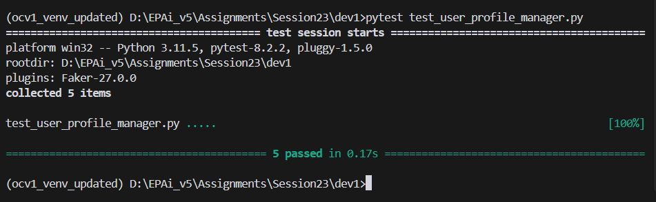
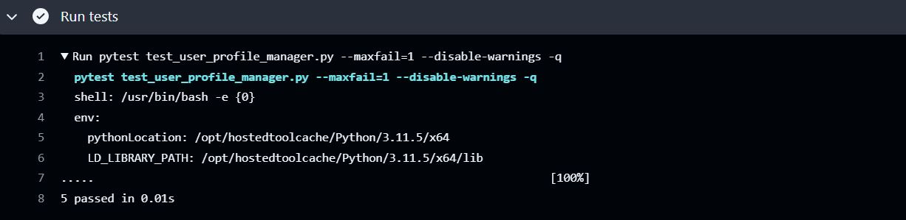

# EPAiV5-Session23 - Descriptors - User Profile Manager 


## UserProfileManager System

### Overview
The **UserProfileManager** system is a Python-based user profile management solution that incorporates validation, caching, and property management. This system manages user attributes (`username`, `email`, `last_login`) with strict validation and memory-efficient caching using weak references.

The key concepts utilized in this system are:
1. **Custom Descriptors** for validation.
2. **Strong and Weak References** for caching user profiles.
3. **Property Resolution** to handle default values.

---

### 1. Custom Descriptors for Validation and Storage

The `ValidatedProperty` descriptor ensures that user attributes are validated before assignment. Each property (`username`, `email`, and `last_login`) has specific validation rules enforced via this descriptor.

#### Key Concepts
- **Descriptor Protocol**: Implements `__get__`, `__set__`, and `__set_name__` to manage property access, setting, and automatic name binding.
- **Validation**: Uses a callable validator to check values before assignment. If validation fails, a `ValueError` is raised.

#### Code Implementation
```python
class ValidatedProperty:
    def __init__(self, validator):
        self.validator = validator
        self.name = None
    
    def __set_name__(self, owner, name):
        self.name = name
    
    def __get__(self, instance, owner):
        if instance is None:
            return self
        return instance.__dict__.get(self.name)
    
    def __set__(self, instance, value):
        if not self.validator(value):
            raise ValueError(f"Invalid value for {self.name}: {value}")
        instance.__dict__[self.name] = value
```

**How It Works**:
1. **Binding**: `__set_name__` assigns the property name to the descriptor.
2. **Validation**: `__set__` ensures that only valid data is assigned.
3. **Data Access**: `__get__` retrieves the value from the instance’s `__dict__`.

---

### 2. Strong and Weak References

The **WeakValueDictionary** is used to cache active user profiles, ensuring memory efficiency. Profiles are automatically removed from the cache if no strong references exist.

#### Key Concepts
- **Caching**: Stores profiles for quick retrieval.
- **Memory Efficiency**: Uses weak references to avoid memory leaks.

#### Code Implementation
```python
from weakref import WeakValueDictionary

class UserProfileManager:
    _instance_cache = WeakValueDictionary()
    
    @classmethod
    def add_to_cache(cls, instance):
        cls._instance_cache[id(instance)] = instance
    
    @classmethod
    def get_from_cache(cls, uid):
        return cls._instance_cache.get(uid)
```

**How It Works**:
1. **Cache Addition**: Profiles are added to the cache using `add_to_cache`.
2. **Cache Lookup**: Profiles are retrieved using `get_from_cache`.
3. **Automatic Removal**: When no strong references exist, the profile is removed from the cache.

---

### 3. Property Resolution and Overrides

The system allows for the **default value of `last_login`** to be defined at the class level, returning it if `last_login` is not explicitly set.

#### Key Concepts
- **Class Attribute Default**: Provides a shared default for all instances.
- **Lazy Evaluation**: Uses property logic to dynamically provide default values.

#### Code Implementation
```python
class UserProfileManager:
    default_last_login = datetime(2000, 1, 1)
    
    @property
    def last_login_with_default(self):
        return self.last_login if self.last_login is not None else self.default_last_login
```

**How It Works**:
1. **Default Handling**: If `last_login` is `None`, the default value is returned.
2. **Instance Property**: Uses a property method to dynamically return the value.

---

### 4. Validation Rules

Each user attribute has its own validation logic enforced by the `ValidatedProperty` descriptor.

| **Attribute**  | **Validation Logic**                                  |
|-----------------|-----------------------------------------------------|
| `username`      | Must be a non-empty string.                          |
| `email`         | Must match a valid email pattern.                    |
| `last_login`    | Must be `None` or a `datetime` object.               |

**Validation Implementation**:
```python
@staticmethod
def validate_username(username):
    return isinstance(username, str) and bool(username.strip())

@staticmethod
def validate_email(email):
    pattern = r'^[a-zA-Z0-9._%+-]+@[a-zA-Z0-9.-]+\.[a-zA-Z]{2,}$'
    return isinstance(email, str) and bool(re.match(pattern, email))

@staticmethod
def validate_last_login(date):
    return date is None or isinstance(date, datetime)
```

---

### 5. Usage Example

```python
# Create a user profile and validate attributes
profile = UserProfileManager()

# Setting properties with validation
profile.username = "JohnDoe"  # Valid username
profile.email = "john@example.com"  # Valid email
profile.last_login = datetime.now()  # Valid last_login

# Adding the profile to cache
UserProfileManager.add_to_cache(profile)

# Retrieve the profile from the cache
cached_profile = UserProfileManager.get_from_cache(id(profile))

print(cached_profile)  # UserProfile(username=JohnDoe, email=john@example.com, last_login=2024-12-16)

# Get last_login with default
print(profile.last_login_with_default)  # Returns last_login if set, else default
```

---

### 6. Unit Tests and Edge Cases

**Test Cases**:
1. **Validation**: Verify invalid `username`, `email`, and `last_login` raise `ValueError`.
2. **Caching**: Verify profiles are retrievable from cache and are removed when no strong references exist.
3. **Defaults**: Verify `last_login_with_default` returns the default if `last_login` is `None`.

```python
def test_username_validation():
    profile = UserProfileManager()
    try:
        profile.username = ""
    except ValueError as e:
        assert "Invalid value" in str(e)

def test_weak_reference_caching():
    profile = UserProfileManager()
    UserProfileManager.add_to_cache(profile)
    assert UserProfileManager.get_from_cache(id(profile)) is profile

def test_last_login_default():
    profile = UserProfileManager()
    assert profile.last_login_with_default == UserProfileManager.default_last_login
```

---

### Test Results

#### Local PC Test Execution



#### Workflow Actions




---

### Conclusion
The **UserProfileManager** system integrates descriptors, weak references, and class-level defaults to offer a robust, memory-efficient, and secure way of managing user profiles. Each core requirement (validation, caching, and property management) is fulfilled with clean, maintainable, and efficient Python code. The use of **WeakValueDictionary** prevents memory leaks, while the **ValidatedProperty** descriptor ensures robust data validation. By providing class-level defaults, the system ensures reliable and consistent user profile management.


---------------------------------------------------------------------------------------------------------------------------------------------------

**Submission by** - Hema Aparna M

**mail id** - mhema.aprai@gmail.com

---------------------------------------------------------------------------------------------------------------------------------------------------
